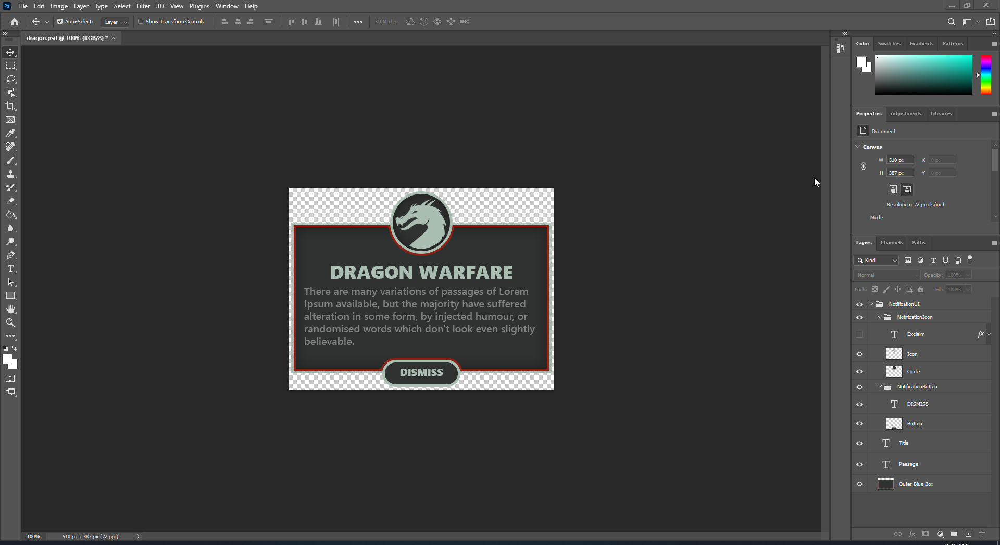
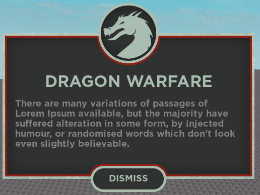
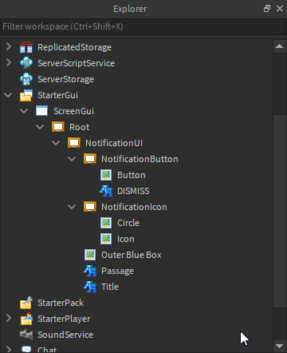

# Rbx-PSD-UI
 A Python tool for processing PSD files to Roblox GUI

## Installation

In order to run this you will need:
* [Python 3](https://www.python.org/)
* [Tarmac](https://github.com/Roblox/tarmac)

Beyond that you will need a few python packages:

* [psd-tools](https://github.com/psd-tools/psd-tools)
* [requests](https://pypi.org/project/requests/)
* [pillow](https://pypi.org/project/Pillow/)

You can install both of these by using the `requirements.txt` under the psd_ui folder.

## Getting started

Roblox PSD UI will take a `.psd` file and convert it into a format that can than be built in Roblox Studio. There are some limitations and things to be aware of so please see the limitations section listed below.

An example of converting a psd to Roblox might look like this:

```
python psd_ui example.psd
```

This will create two directories:

```
.\output\example\images 
-> contains images and json needed to build UI

C:\Users\USER\AppData\Local\Roblox\Versions\STUDIO_VERSION\content\psd_ui\example
-> contains images used for testing ui locally before upload
```

From here users can use the `output.json` file alongside the `build_place.rbxl` to create their UI. 

Keep in mind however none of the images being used in this ui are actually uploaded. To upload the images to the site users must use the `--upload` or `-u` flag when calling the `psd_ui` command.

```
python psd_ui example.psd --upload
```

This will prompt the user for a Roblox security cookie which tells tarmac which account to actually upload the images to.

For users that don't want to copy paste a security cookie each time they can simply create a file under the project directory called `cookie.txt` and the program will pull the cookie from the file automatically.

## Limitations

The most blaring limitation of this tool is that it does not work with layers that are not fully rasterized. This means any layers with effects such drop shadows or masks will have those effects ignored unless they are manually rasterized/merged into the layer. It's a bit annoying, but I think it's not an unreasonable limitation to work within.

## Work to be done

Most image editing programs can export files to a `.psd` format; this is the reason I chose to make the tool work with `.psd` files. However, most of these programs do not match Adobe's format exactly.

One of the best examples of this are text objects. For example, say you created a text layer in GIMP and exported the project to a `.psd` file. In the conversion process GIMP would rasterize that text layer and it would lose any meaningful data about the text (e.g. the content, color, size, etc). This is a problem though because GIMP users using this tool still want `psd_ui` to recognize that text layer as a text object when they import their UI into studio.

So to get around this you must use special flags in the layer name to let the tool know that this layer should be a text object instead of an image label.

In the case of a text layer we flag it by naming it `TEXT_MyLayer`. This way the tool knows to instead convert this to a text object. None of the information like the content or color of the text will be carried over like you'd get if the file was created in photoshop, but that can be set by the developer once the UI has been imported into studio.

There are plenty more examples of this I'm sure, but I haven't actually programmed anything in except the example I just described above. If you think you have a good flag then I would strongly suggest contributing it to this project for others to use as well!

## Example

This is an example psd that was imported into studio using this tool.





## Example video

Watch this video to see a really quick example of me creating the above UI with this tool.

https://www.youtube.com/watch?v=x_RaPDyoz7k
